# Resolving Oracle Cloud "Out of Capacity" issue and getting free VPS with 4 ARM cores / 24GB of memory

<p align="center">
  <a href="https://github.com/hitrov/oci-arm-host-capacity/actions"></a>
  <a href="https://discord.gg/fKZQQStjMN"></a>
</p>

Very neat and useful configuration was recently [announced](https://blogs.oracle.com/cloud-infrastructure/post/moving-to-ampere-a1-compute-instances-on-oracle-cloud-infrastructure-oci) at Oracle Cloud Infrastructure (OCI) blog as a part of Always Free tier. Unfortunately, as of July 2021, it's very complicated to launch an instance due to the "Out of Capacity" error. Here we're solving that issue as Oracle constantly adds capacity from time to time.

> Each tenancy gets the first 3,000 OCPU hours and 18,000 GB hours per month for free to create Ampere A1 Compute instances using the VM.Standard.A1.Flex shape (equivalent to 4 OCPUs and 24 GB of memory).

This approach requires **PHP 7.4 | 8.0 | 8.1 | 8.2** and **composer** installed and will call "LaunchInstance" OCI API [endpoint](https://docs.oracle.com/en-us/iaas/api/#/en/iaas/20160918/Instance/LaunchInstance). We'll utilise the [package](https://packagist.org/packages/hitrov/oci-api-php-request-sign) which I've written (and [published](https://github.com/hitrov/oci-api-php-request-sign)) some time ago, here's the [article](https://hitrov.medium.com/creating-mini-php-sdk-to-sign-oracle-cloud-infrastructure-api-requests-d91a224c7008?sk=5b4405c1124bfeac30a370630fd94126).

If you prefer article style, here's a link to [Medium](https://hitrov.medium.com/resolving-oracle-cloud-out-of-capacity-issue-and-getting-free-vps-with-4-arm-cores-24gb-of-6ecd5ede6fcc?sk=01d761f7cd80c77e0fed773972f4d1a8)

YouTube video instruction [https://youtu.be/uzAqgjElc64](https://youtu.be/uzAqgjElc64) 
is a bit outdated regarding [Configuration](#configuration) but still can be useful for the rest.

If you appreciate what I did please consider supporting me on [Patreon](https://www.patreon.com/hitrov)

- [Generating API key](#generating-api-key)
- [Installation](#installation)
- [Configuration](#configuration)
  - [Create/copy .env file](#createcopy-env-file)
  - [General](#general)
  - [Private key](#private-key)
  - [Instance parameters](#instance-parameters)
    - [Mandatory](#mandatory)
      - [OCI_SUBNET_ID and OCI_IMAGE_ID](#oci_subnet_id-and-oci_image_id)
      - [OCI_SSH_PUBLIC_KEY (SSH access)](#oci_ssh_public_key-ssh-access)
    - [Optional](#optional)
- [Running the script](#running-the-script)
- [Periodic job setup (cron)](#periodic-job-setup-cron)
  - [Linux / WSL](#linux--wsl)
  - [GitHub actions (workflows)](#github-actions-workflows)
    - [Setup](#setup)
    - [Read This Carefully](#read-this-carefully)
- [How it works](#how-it-works)
- [Assigning public IP address](#assigning-public-ip-address)
- [Troubleshooting](#troubleshooting)
  - [Private key issues](#private-key-issues)
  - [SSH key issues](#ssh-key-issues)
- [Multiple configuration support](#multiple-configuration-support)
- [Conclusion](#conclusion)

## Generating API key

After logging in to [OCI Console](http://cloud.oracle.com/), click profile icon and then "User Settings"

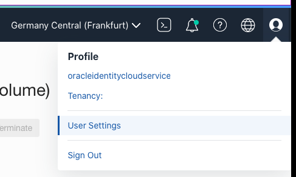

Go to Resources -> API keys, click "Add API Key" button

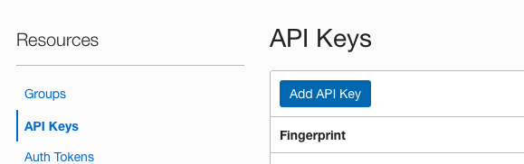

Make sure "Generate API Key Pair" radio button is selected, click "Download Private Key" and then "Add".

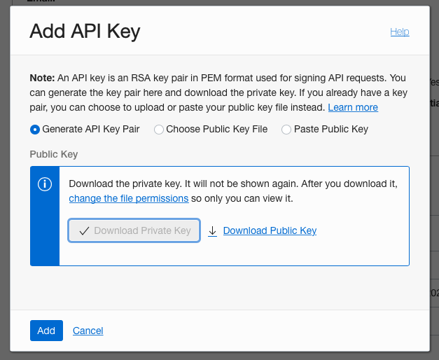

Copy the contents from textarea and save it to file with a name "config". I put it together with *.pem file in newly created directory /home/ubuntu/.oci

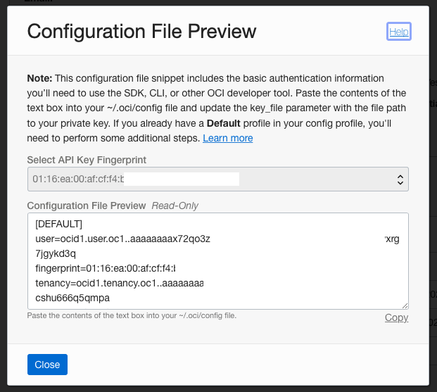

## Installation

Clone this repository
```bash
git clone https://github.com/hitrov/oci-arm-host-capacity.git
```
run
```bash
cd oci-arm-host-capacity/
composer install
```

## Configuration

### Create/copy .env file

Copy `.env.example` as `.env`
```bash
cp .env.example .env
```
You must modify `.env` file below. **Don't push/share it as it possibly contains sensitive information.** 

All parameters except `OCI_AVAILABILITY_DOMAIN` are mandatory to be set. Please read the comments in `.env` file as well.

### General

Region, user, tenancy, fingerprint should be taken from textarea during API key generation step.
Adjust these values in `.env` file accordingly:
- `OCI_REGION`
- `OCI_USER_ID`
- `OCI_TENANCY_ID`
- `OCI_KEY_FINGERPRINT`

### Private key

`OCI_PRIVATE_KEY_FILENAME` is an absolute path (including directories) or direct public accessible URL to your *.pem private key file.

### Instance parameters

#### Mandatory

##### OCI_SUBNET_ID and OCI_IMAGE_ID

You must start instance creation process from the OCI Console in the browser (Menu -> Compute -> Instances -> Create Instance)

Change image and shape. 
For Always free AMD x64 - make sure that "Always Free Eligible" availabilityDomain label is there:

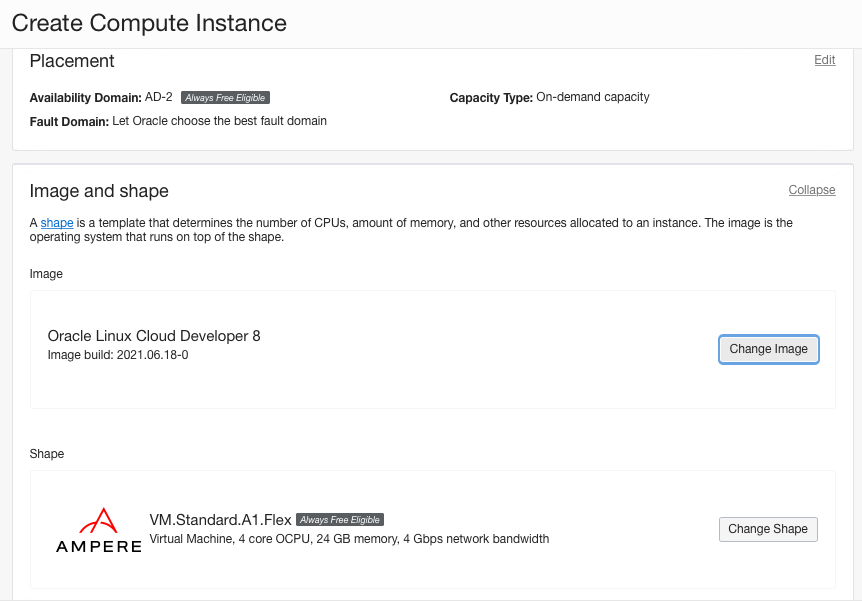

ARMs can be created anywhere within your home region.

Adjust Networking section, set "Do not assign a public IPv4 address" checkbox. If you don't have existing VNIC/subnet, please create VM.Standard.E2.1.Micro instance before doing everything.

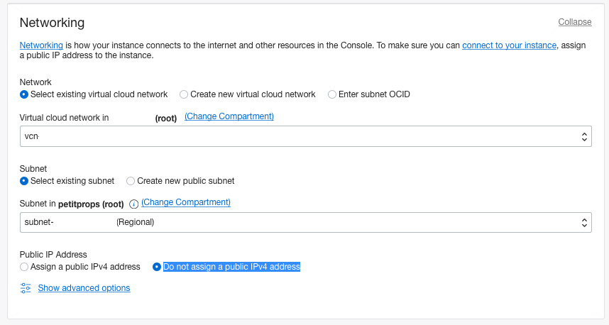

"Add SSH keys" section does not matter for us right now. Before clicking "Create"…

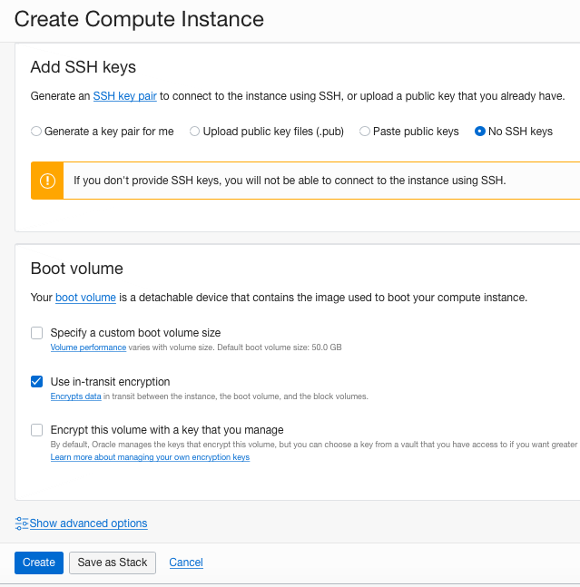

…open browser's dev tools -> network tab. Click "Create" and wait a bit most probably you'll get "Out of capacity" error. Now find /instances API call (red one)…

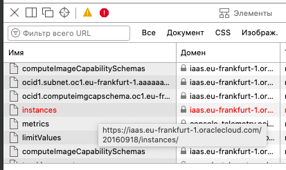

…and right click on it -> copy as curl. Paste the clipboard contents in any text editor and review the data-binary parameter. 
Find `subnetId`, `imageId` and set `OCI_SUBNET_ID`, `OCI_IMAGE_ID`, respectively.

Note `availabilityDomain` for yourself, then read the corresponding comment in `.env` file regarding `OCI_AVAILABILITY_DOMAIN`.

##### OCI_SSH_PUBLIC_KEY (SSH access)

In order to have secure shell (SSH) access to the instance you need to have a keypair, besically 2 files:
- ~/.ssh/id_rsa 
- ~/.ssh/id_rsa.pub

Second one (public key) contents (string) should be provided to a command below. 
The are plenty of tutorials on how to generate them (if you don't have them yet), we won't cover this part here.

```bash
cat ~/.ssh/id_rsa.pub
```

Output should be similar to
```bash
ssh-ed25519 AAAAC3NzaC1lZDI1NTE5AAAAIFwZVQa+F41Jrb4X+p9gFMrrcAqh9ks8ATrcGRitK+R/ github.com@hitrov.com
```

Change `OCI_SSH_PUBLIC_KEY` inside double quotes - paste the contents above (or you won't be able to login into the newly created instance).
**NB!** No new lines allowed!

#### Optional

`OCI_OCPUS` and `OCI_MEMORY_IN_GBS` are set `4` and `24` by default. Of course, you can safely adjust them. 
Possible values are 1/6, 2/12, 3/18 and 4/24, respectively.
Please notice that "Oracle Linux Cloud Developer" image can be created with at least 8GB of RAM (`OCI_MEMORY_IN_GBS`).

If for some reason your home region is running out of Always free AMD x64 (1/8 OPCU + 1GB RAM), replace values below.
**NB!** Setting the `OCI_AVAILABILITY_DOMAIN` to `Always Free Eligible` is mandatory for non-ARM architecture!
```bash
OCI_SHAPE=VM.Standard.E2.1.Micro
OCI_OCPUS=1
OCI_MEMORY_IN_GBS=1
OCI_AVAILABILITY_DOMAIN=FeVO:EU-FRANKFURT-1-AD-2
```

If you don't have instances of selected shape at all, and need only one, leave the value of `OCI_MAX_INSTANCES=1`. 
When you managed to launch one and need more (or 2 from scratch), set to `OCI_MAX_INSTANCES=2`. 

## Running the script

```bash
php ./index.php
```

I bet that the output (error) will be similar to the one in a browser a few minutes ago
```json
{
    "code": "InternalError",
    "message": "Out of host capacity."
}
```
or if you already have instances:
```json
{
    "code": "LimitExceeded",
    "message": "The following service limits were exceeded: standard-a1-memory-count, standard-a1-core-count. Request a service limit increase from the service limits page in the console. "
}
```

## Periodic job setup (cron)

### Linux / WSL

You can now setup periodic job to run the command

Create log file:
```bash
touch /path/to/oci-arm-host-capacity/oci.log
```
Set permissions for PHP script to modify it:
```bash
chmod 777 /path/to/oci-arm-host-capacity/oci.log
```
Get full path to PHP binary
```bash
which php
```
Usually that's `/usr/bin/php`

Setup itself:
```bash
EDITOR=nano crontab -e
```
Add new line to execute the script every minute and append log the output:
```bash
* * * * * /usr/bin/php /path/to/oci-arm-host-capacity/index.php >> /path/to/oci-arm-host-capacity/oci.log
```
**NB!** Use absolute paths wherever possible

...and save the file (F2, press Y to confirm overwrite, then Enter).

There could be cases when cron user won't have some permissions, there're ways to solve it:

1. Setup job for root user by executing `EDITOR=nano sudo crontab -e`
2. Move this directory (`oci-arm-host-capacity`) into web server's one e.g. /usr/share/nginx/html and setup cron this way:
```bash
* * * * * curl http://server.add.re.ss/oci-arm-host-capacity/index.php >> /path/to/oci-arm-host-capacity/oci.log
```
You can also visit the URL above and see the same command output as by running from the shell.

### GitHub actions (workflows)

In order to test the script using GitHub runners (their virtual machines) please complete [Setup](#setup). 
**NB!** To avoid the ban of your Github account [Read This Carefully](#read-this-carefully) **!!!**

#### Setup

1. Fork this repository
2. Never push `.env` file, it's in `.gitignore` for a reason
3. Instead of copying/modifying `.env` file, use `Secrets` in your own repository `Settings`:

`https://github.com/{your-username}/oci-arm-host-capacity/settings/secrets/actions`

4. Click `New repository secret` and set all the values (**one by one**) that you'd set in `.env` file e.g.

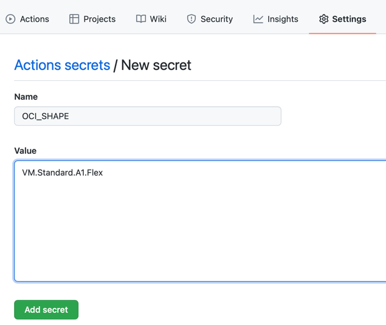

*NB!* No need to double quote any value here!

5. As for the private key, you have 2 options. Either:
- upload to any web server accessible from the Internet by using just URL or...
- upload in the [bucket](https://cloud.oracle.com/object-storage/buckets) and `Create Pre-Authenticated Request`. 

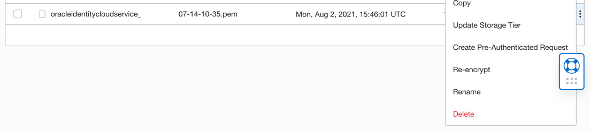

6. Copy and save the URL from (5) as `OCI_PRIVATE_KEY_FILENAME` GitHub secret.
7. Go to any other directory e.g. `cd /Users/hitrov`
8. `git clone https://github.com/{your-username}/oci-arm-host-capacity`
9. Adjust the file `.github/workflows/tests.yml` according to [this commit](https://github.com/hitrov/oci-arm-host-capacity/commit/67fe41ebfb9f385ae1614c97b74195ea318c8db7), just execute:
```bash
git checkout 67fe41ebfb9f385ae1614c97b74195ea318c8db7 -- .github/workflows/tests.yml
```
10. Commit and push this file
```bash
git commit -m "Modify workflow to test out periodic job" .github/workflows/tests.yml
git push origin main
```
11. Go to `https://github.com/{your-username}/oci-arm-host-capacity/actions` and check how `Run script` job. 

Here's the example https://github.com/hitrov/oci-arm-host-capacity/runs/4727904401?check_suite_focus=true

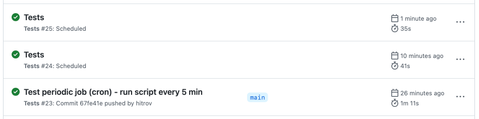

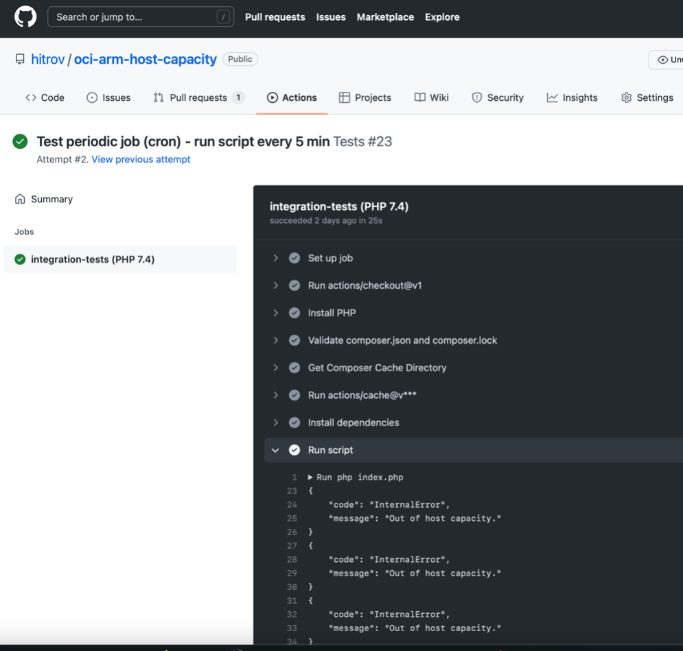

#### Read This Carefully

Specific GitHub Workflows [commit](https://github.com/hitrov/oci-arm-host-capacity/commit/67fe41ebfb9f385ae1614c97b74195ea318c8db7) 
used in the [Setup](#setup) take an advantage of [Scheduled events](https://docs.github.com/en/actions/learn-github-actions/events-that-trigger-workflows#scheduled-events)  
and **will endlessly run the script every 5-20 minutes** (how exactly often - depends on runners' availability). 

**NB!** After you're done with testing, **immediately delete .github/workflows/tests.yml** (because you don't need integration tests - they're written taking into account instances that I have) and push to the `main` branch 
because infinite run actually violates the [Terms of Use](https://docs.github.com/en/github/site-policy/github-terms-for-additional-products-and-features#actions):
```
Actions should not be used for:
...
- if using GitHub-hosted runners, any other activity unrelated to the production, testing, deployment, or publication 
of the software project associated with the repository where GitHub Actions are used.
...
GitHub may monitor your use...
Misuse of GitHub Actions may result in termination of jobs, restrictions in your ability to use GitHub Actions, 
or the disabling of repositories created to run Actions in a way that violates these Terms.
```

This is how you do:
```bash
git rm .github/workflows/tests.yml
git commit -m "Delete workflow file" .github/workflows/tests.yml
git push origin main
```

## How it works

Before the instance creation, script will: 
1. Call [ListAvailabilityDomains](https://docs.oracle.com/en-us/iaas/api/#/en/identity/20160918/AvailabilityDomain/ListAvailabilityDomains) OCI API method
2. Call [ListInstances](https://docs.oracle.com/en-us/iaas/api/#/en/iaas/20160918/Instance/ListInstances) OCI API method
and check whether there're already existing instances with the same `OCI_SHAPE`, 
as well as number of them `OCI_MAX_INSTANCES` (you can safely adjust the last one if you wanna e.g. two `VM.Standard.A1.Flex` with 2/12 - 2 OCPUs and 12GB RAM - each).

Script won't create new instance if current (actual) number return from the API exceeds the one from `OCI_MAX_INSTANCES` variable.

In case of success the JSON output will be similar to

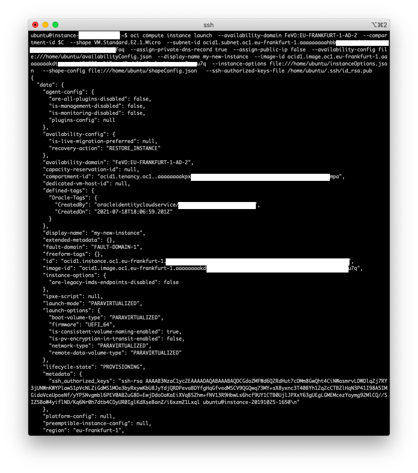

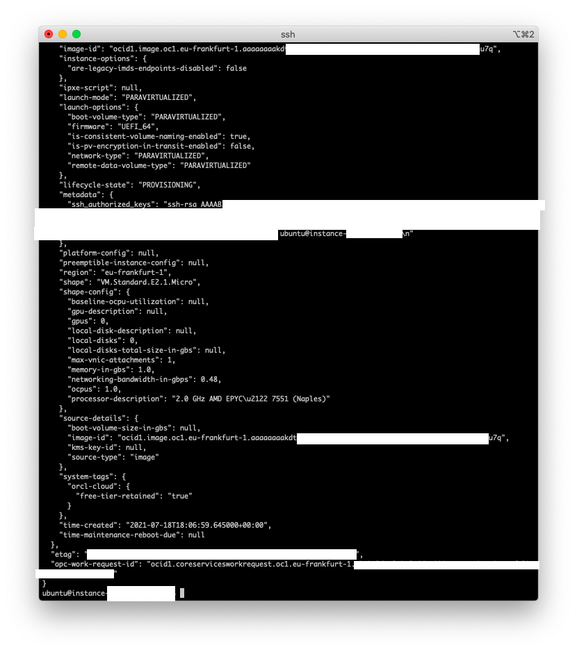

## Assigning public IP address

We are not doing this during the command run due to the default limitation (2 ephemeral addresses per compartment). That's how you can achieve this. When you'll succeed with creating an instance, open OCI Console, go to Instance Details -> Resources -> Attached VNICs by selecting it's name

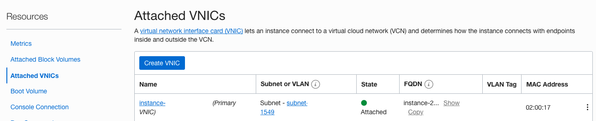

Then Resources -> IPv4 Addresses -> Edit


Choose ephemeral and click "Update"

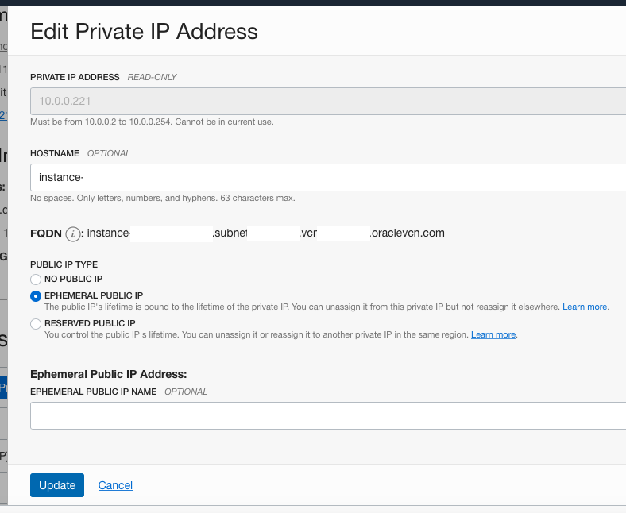

## Troubleshooting

### Private key issues
- `OCI_PRIVATE_KEY_FILENAME` doesn't exist. 
```bash
PHP Fatal error:  Uncaught Hitrov\OCI\Exception\PrivateKeyFileNotFoundException: Private key file does not exist: /path/to/oracleidentitycloudservice_***-07-14-10-35.pem in /Users/hitrov/Sites/oci-arm-host-capacity/vendor/hitrov/oci-api-php-request-sign/src/Hitrov/OCI/Signer.php:346
```
Make sure path is absolute (full including directories), you should see it's content by executing:
```bash
cat /path/to/oracleidentitycloudservice_***-07-14-10-35.pem
```
If that's URL make sure it's inside double quotes, and opens without redirections or additional actions:
```bash
curl "https://url.to/oracleidentitycloudservice_***-07-14-10-35.pem"
```
- Permission denied - private key file is inaccessible for this PHP script:
```bash
PHP Warning:  file_get_contents(/path/to/oracleidentitycloudservice_***-07-14-10-35.pem): failed to open stream: Permission denied in /Users/hitrov/Sites/oci-arm-host-capacity/vendor/hitrov/oci-api-php-request-sign/src/Hitrov/OCI/Signer.php on line 225
PHP Fatal error:  Uncaught TypeError: Return value of Hitrov\OCI\Signer::getPrivateKey() must be of the type string or null, bool returned in /Users/hitrov/Sites/oci-arm-host-capacity/vendor/hitrov/oci-api-php-request-sign/src/Hitrov/OCI/Signer.php:225
```
Fastest way to resolve:
```bash
chmod 777 /path/to/oracleidentitycloudservice_***-07-14-10-35.pem
```

### SSH key issues
- If you have new line(s) / line ending(s) in `OCI_SSH_PUBLIC_KEY` you will encounter:
```json
{
  "code": "InvalidParameter",
  "message": "Unable to parse message body"
}
```
- If public key is incorrect:
```json
{
    "code": "InvalidParameter",
    "message": "Invalid ssh public key; must be in base64 format"
}
```
Copy the proper contents of `~/.ssh/id_rsa.pub` again and make sure it's inside double quotes. 
Or re-generate pair of keys. Make sure you won't unintentionally overwrite your existing ones. 

## Multiple configuration support

If you need 2+ `.env` files (or you have multiple Oracle Cloud Infrastructure accounts), 
run the script in a way when you pass argument with environment filename e.g. 
```bash
php index.php .env.my_acc1
```
Custom env filenames are supported only for CLI (command line interface). 
If you call this script with browser/curl using web sapi (Apache, nginx), 
find the best way to pass the 2nd argument here (e.g. `$_GET` parameter):
```php
$dotenv = Dotenv::createUnsafeImmutable(__DIR__, $envFilename);
```
as I don't want to overcomplicate this script for rare use cases.

## Conclusion

That's how you will login when instance will be created (notice opc default username)

```bash
ssh -i ~/.ssh/id_rsa opc@ip.add.re.ss
```

If you didn't assign public IP, you can still copy internal FQDN or private IP (10.x.x.x) 
from the instance details page and connect from your other instance in the same VNIC. e.g.

```bash
ssh -i ~/.ssh/id_rsa opc@instance-20210714-xxxx.subnet.vcn.oraclevcn.com
```
